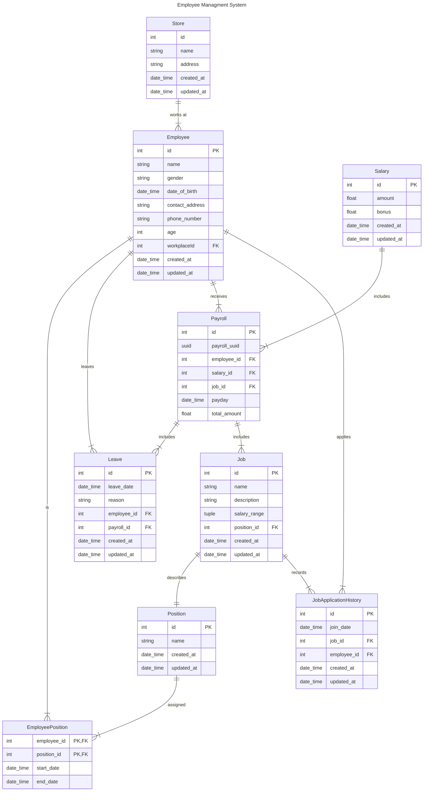

# coffee_shop_employee_service

This is the service for managing employees in a coffee shop

## Project Structure

Since this project is a microservice included in a larger project, file-type based structuring approach is prefered to use for this project.

Ref: [FastAPI Project Structuring Practices](https://medium.com/@amirm.lavasani/how-to-structure-your-fastapi-projects-0219a6600a8f)

## ERD

## Best Practices

Ref: [Best Practices](https://github.com/zhanymkanov/fastapi-best-practices)
